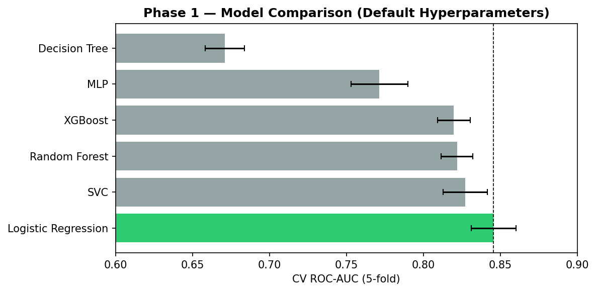
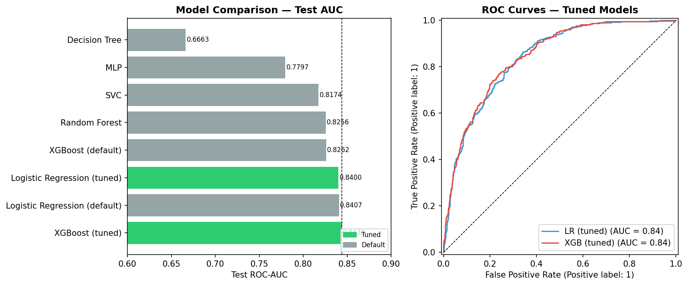
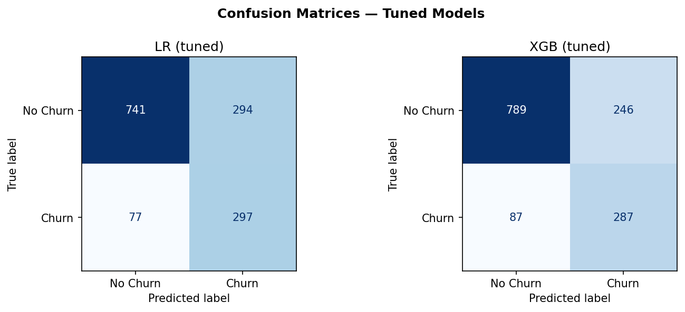

# Telco Customer Churn Prediction

A structured machine learning project on the IBM Telco Customer Churn dataset, covering exploratory data analysis, preprocessing pipeline design, multi-model comparison, and hyperparameter tuning. Built for educational depth and portfolio demonstration.

---

## Project Overview

Customer churn — the rate at which customers stop using a service — is a high-value prediction target for subscription businesses. This project builds a complete, production-style ML pipeline from raw data to tuned model, with emphasis on understanding *why* each modelling decision was made, not just *what* was done.

**Dataset:** IBM Telco Customer Churn (~7,000 customers, 20 features, ~26% churn rate)

---

## Repository Structure

```
telco-churn/
├── data/
│   └── Telco-Customer-Churn.csv
├── outputs/
│   ├── phase1_comparison.png
│   ├── phase3_results.png
│   └── confusion_matrices.png
├── telco_churn.ipynb
└── README.md
```

---

## Pipeline Architecture

The preprocessing pipeline was built using `sklearn` and `imblearn`, with the following components:

| Step | Detail |
|---|---|
| Missing value imputation | Custom `TotalChargesImputer` (space → NaN → median) |
| Binary encoding | `FunctionTransformer` mapping Yes/No → 1/0 |
| Dummy encoding | `OneHotEncoder(drop='first')` for nominal categoricals: contract type, internet service, payment method |
| Standard scaling | Numeric features: tenure, monthly charges, total charges |
| Class imbalance | SMOTE applied inside `imblearn` Pipeline (train folds only) |

Critically, SMOTE is applied **inside** the pipeline, ensuring synthetic samples are never generated from test data — a common source of data leakage in churn projects.

---

## Model Comparison — Phase 1 (Default Hyperparameters)

All models evaluated with 5-fold stratified cross-validation, scored on ROC-AUC.

| Model | CV ROC-AUC | Std |
|---|---|---|
| Logistic Regression | 0.8456 | ±0.0145 |
| SVC | 0.8271 | ±0.0144 |
| Random Forest | 0.8219 | ±0.0103 |
| XGBoost | 0.8198 | ±0.0107 |
| MLP | 0.7714 | ±0.0185 |
| Decision Tree | 0.6710 | ±0.0128 |



**Key finding:** Logistic Regression outperforms all ensemble methods at default settings. This reflects the largely linear, shallow nature of the churn signal in this dataset — contract type, tenure, and monthly charges have near-monotonic relationships with churn probability that a linear model captures efficiently. Tree ensembles gain their advantage from modelling complex feature interactions; those interactions are not strongly present here at this dataset scale.

---

## Hyperparameter Tuning — Phase 2

GridSearchCV (5-fold, ROC-AUC scoring) was applied to the two most promising models.

**Logistic Regression**
- Search space: `C` ∈ {0.01, 0.1, 1, 10, 100}, penalty ∈ {L1, L2}, solver = saga
- Best params: `C=10.0`, `penalty=l1`
- CV AUC: 0.8459 (vs 0.8456 default — negligible improvement)
- Interpretation: default regularization was already well-suited; L1 sparsity had nothing meaningful to prune after preprocessing

**XGBoost**
- Search space: depth, learning rate, n_estimators, subsample, colsample, L2 regularization (216 combinations)
- Best params: `max_depth=3`, `learning_rate=0.01`, `n_estimators=500`, `subsample=0.7`, `colsample_bytree=0.7`, `reg_lambda=1.0`
- CV AUC: 0.8480 (vs 0.8198 default — meaningful improvement)
- Interpretation: shallow trees confirm low dataset complexity; slow learning rate with many estimators navigates the loss landscape more carefully; subsampling reduces overfitting to SMOTE-generated samples

---

## Final Test-Set Results

| Model | Test ROC-AUC |
|---|---|
| **XGBoost (tuned)** | **0.8438** |
| Logistic Regression (default) | 0.8407 |
| Logistic Regression (tuned) | 0.8400 |
| XGBoost (default) | 0.8262 |
| Random Forest | 0.8256 |
| SVC | 0.8174 |
| MLP | 0.7797 |
| Decision Tree | 0.6663 |



### Tuned Model Error Analysis

| | LR (tuned) | XGBoost (tuned) |
|---|---|---|
| Churn Recall | **79.4%** (297/374) | 76.7% (287/374) |
| Churn Precision | 50.3% | **53.8%** |
| False Negatives | **77** | 87 |
| False Positives | 294 | **246** |



**Both models are statistically equivalent** at this test set size — the 0.004 AUC gap is within noise. The meaningful difference is in their error tradeoff:

- **LR** casts a wider net: higher churn recall, more false positives. Preferred when retention interventions are cheap (e.g. automated emails).
- **XGBoost** is more selective: lower recall, higher precision, fewer false positives. Preferred when interventions are costly (e.g. agent calls, large discounts).

Model selection for production would depend on the business cost matrix, not AUC alone.

---

## Key Takeaways

1. **Preprocessing quality matters more than model complexity** on well-structured tabular datasets. A clean pipeline with a linear model matched or beat untuned ensembles.
2. **Tuning direction is informative.** XGBoost's best config (shallow, slow, regularised) confirmed the dataset has limited non-linear complexity — the model converged to a near-linear solution.
3. **AUC is insufficient for operational decisions.** Precision-recall tradeoffs map directly to business costs and should drive final model choice.
4. **SMOTE placement matters.** Applying SMOTE inside the pipeline prevents leakage and is essential for valid cross-validation scores.

---

## Dependencies

```
scikit-learn
imbalanced-learn
xgboost
pandas
numpy
matplotlib
```

---

*Full code and notebook available in this repository. Built for educational depth and portfolio demonstration.*
